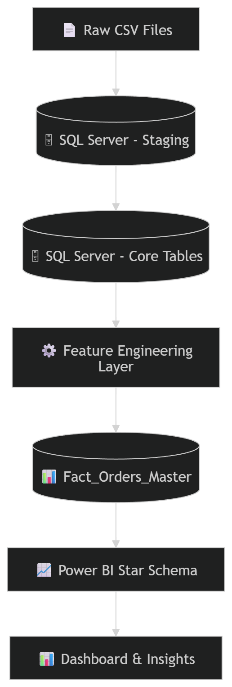

# Olist Delivery Performance Analysis

## Project Overview
This project is an end-to-end data analytics case study designed to reflect a real-world business scenario. The objective is to analyse delivery performance within Olist’s marketplace and identify operational inefficiencies that impact customer satisfaction and revenue.

The project follows a structured workflow starting from raw data ingestion to business decision-making. It combines data engineering practices with analytical reasoning to deliver actionable insights.

---

## Business Problem
Olist experiences inconsistent delivery performance across sellers and regions. Late deliveries may reduce customer satisfaction and impact repeat revenue, but the underlying drivers and financial exposure are unclear.

---

## Core Business Question
What operational factors are driving delivery delays, and how do those delays impact customer satisfaction and revenue performance?

---

## Hypotheses
The analysis is driven by the following hypotheses:

- **H1:** Delivery delays are operationally significant  
- **H2:** Delivery delays are concentrated among a minority of sellers  
- **H3:** Longer delivery distances increase the probability of delay  
- **H4:** Late deliveries reduce customer satisfaction  
- **H5:** High-delay sellers create disproportionate revenue exposure  

---

## Target Audience
- **Primary Stakeholder:** Head of Operations  
- **Secondary Stakeholder:** Head of Customer Experience  
- **Evaluator:** BI Manager  

---

## Project Approach
This project is structured into multiple phases to reflect a real-world analytics workflow:

1. Define business context and hypotheses  
2. Build data infrastructure and validate schema  
3. Prepare and transform data into analytical datasets  
4. Perform hypothesis-driven analysis  
5. Design a scalable data model for reporting  
6. Develop dashboards for decision-making  
7. Deliver business recommendations  

---

## Tech Stack

### Main Stack
- SQL Server (T-SQL)
- Power BI
- Excel (CSV data source)

### Supporting Stack
- Data Modelling (Star Schema)
- ETL / ELT using SQL
- DAX (Power BI)
- Power Query
- Git & GitHub (version control and project structuring)

---

## Data Architecture (Planned)
This project follows a layered data architecture:

  

*A visual architecture diagram will be updated in later stages.*

---

## Data Model

  

The dataset follows an order-centric relational structure where the `orders` table acts as the central entity.

* One order can have multiple items (`order_items`)
* One order can have multiple payments (`order_payments`)
* One order can have one or more reviews (`order_reviews`)
* Each order is linked to a customer (`customers`)
* Each item is associated with a product and fulfilled by a seller

This structure requires careful handling of one-to-many relationships to avoid row duplication during analysis. Aggregation is applied before joining transactional tables to maintain a consistent grain at the order level.

This modelling approach ensures accurate aggregation and prevents revenue inflation caused by row-level duplication.

---

## Dataset Description
The dataset consists of multiple relational tables representing Olist’s marketplace operations, including:

- Orders  
- Customers  
- Sellers  
- Order Items  
- Payments  
- Reviews  
- Products  
- Geolocation data  

These datasets are integrated to build a unified analytical view at the order level.

---

## Data Source

This project uses the **Brazilian E-Commerce Public Dataset by Olist**, available on Kaggle.

- **Source:** Kaggle  
- **Author:** Olist  
- **Link:** https://www.kaggle.com/datasets/olistbr/brazilian-ecommerce  

The dataset contains approximately 100,000 e-commerce orders from 2016 to 2018 across multiple marketplaces in Brazil. It provides a multi-dimensional view of each order, including customer information, seller details, payments, delivery performance, product attributes, and customer reviews.

The data has been anonymised, and sensitive business information has been removed or masked.

*Note: This dataset is used strictly for educational and portfolio purposes.*

---

## Data Considerations

- An order may contain multiple items  
- Each item can be fulfilled by different sellers  
- Delivery performance must be analysed at the order level  
- Geolocation data enables distance-based analysis  

These factors influence how the analytical model is designed.

---

## Key KPIs (Initial Definition)

### Delivery KPIs
- Average Delivery Time  
- On-Time Delivery Rate  
- Late Delivery %  
- Delivery Delay Days  
- Shipping Duration vs Estimated Duration  

### Customer KPIs
- Average Review Score  
- Low Rating %  
- Repeat Purchase Rate (to be derived)  
- Customer Lifetime Value (optional)  

### Financial KPIs
- Revenue per Order  
- Freight Cost %  
- Payment Method Distribution  

### Operational KPIs
- Seller Performance  
- Regional Performance  
- Product Category Performance  

*Final KPI definitions will evolve as the project progresses.*

---

## Repository Structure
This repository is organised using a branch-based structure to reflect each phase of the project:

- `production` → Main branch with final outputs and documentation  
- `part-1-strategic-foundation` → Business context, problem definition, hypotheses  
- `part-2-data-infrastructure` → Data ingestion, schema validation  
- `part-3-data-preparation` → Data transformation and feature engineering  
- `part-4-hypothesis-testing` → Analytical queries and validation  
- `part-5-data-modeling` → Star schema design for Power BI  
- `part-6-dashboard` → Power BI reports and visualisations  
- `part-7-case-study` → Executive summary and business recommendations  

Each branch contains its own README with detailed explanations, SQL scripts, and supporting documentation for that phase. 

---

## Project Progress

### Completed
- Part I – Strategic Foundation  
- Part II – Data Infrastructure Setup  

### In Progress
- Part III – Data Preparation & Feature Engineering  
  - Build order-level analytical dataset (Fact_Orders_Master)  
  - Engineer delivery, distance, and performance features 

### Upcoming
- Part IV – Hypothesis Testing  
- Part V – Data Modeling for Power BI  
- Part VI – Dashboard Development  
- Part VII – Case Study Writing  

---

## Business Impact (Expected)
This project aims to:

- Identify operational inefficiencies in delivery performance  
- Detect high-risk sellers contributing to delays  
- Quantify revenue exposure due to poor delivery performance  
- Provide actionable insights to improve customer satisfaction  

---

## How to Navigate This Repository
Each branch represents a distinct phase of the project.  

- Navigate to individual branches to explore SQL scripts, documentation, and outputs  
- The `production` branch will contain the final consolidated version of the project  

---

## Project Status
This project is being developed iteratively to reflect real-world analytics workflows. Each phase is completed, validated, and version-controlled before moving to the next.

---

## Next Steps
- Complete data ingestion and schema validation  
- Build analytical base tables  
- Engineer delivery and distance features  
- Begin hypothesis-driven analysis  

---

## 👨‍💻 About the Author

**Abhishek Chakravarty**  
Data Analyst | BI Developer  

I specialise in building end-to-end data solutions that translate complex datasets into clear, actionable business insights. My work focuses on identifying inefficiencies, quantifying impact, and enabling data-driven decision-making at scale.

This project demonstrates:
- Structured, hypothesis-driven analytics
- Scalable data modelling (star schema)
- End-to-end ownership (data ingestion → transformation → insights → dashboarding)

💡 Key Strengths:
- Business-first analytical thinking  
- Strong SQL and data modelling expertise  
- Insight generation with measurable impact  

📊 Tech Stack:  
`SQL Server` • `Power BI` • `DAX` • `ETL` • `Data Modelling`

🔗 [LinkedIn](https://www.linkedin.com/in/iamchakravarty/)  
📂 [Portfolio](https://abhishekchakravarty.netlify.app/)
